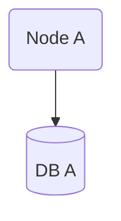

# Signal Processing Workshop

Welcome to the Signal Processing Workshop! This project provides both Python implementations of classic signal processing algorithms and a modern web interface for interactive exploration and visualization.

## Project Structure

- **PythonImplementations/**: Python modules for DSP algorithms (LPC, Fourier, filters, etc.) and graphics utilities (oscilloscope, waveform, etc.).
- **spw-site/**: A React + Vite web app for interactive demos, visualization, and documentation.
- **docs/**: Documentation for the project, viewable with [Docsify](https://docsify.js.org/).

---

## Getting Started

### Python Implementations

1. **Requirements**: Python 3.12+
2. **Install dependencies (using [uv](https://github.com/astral-sh/uv))**:

   ```sh
   uv pip install -r PythonImplementations/requirements.txt
   ```

3. **Run the main script:**

   ```sh
   python PythonImplementations/main.py
   ```

4. **Explore modules:**
   - DSP algorithms: `PythonImplementations/dsp/`
   - Graphics: `PythonImplementations/graphics/`

### Website (React + Vite)

1. **Install dependencies:**

   ```sh
   cd spw-site
   npm install
   ```

2. **Start the dev server:**

   ```sh
   npm run dev
   ```

3. **Open** [http://localhost:5173](http://localhost:5173) in your browser.

---

## Documentation

This documentation uses [Docsify](https://docsify.js.org/) for live previews. To serve the docs locally:

```sh
npm install -g docsify-cli
cd docs
docsify serve
```

---

## Example Usages

<!-- tabs:start -->

#### **Mermaid**



#### **LaTeX with MathJax**

$$
a \to b
$$

<!-- tabs:end -->
