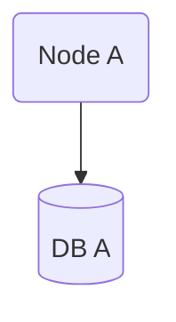

# Example usages

> An awesome project.

<!-- tabs:start -->

#### **Mermaid**

Hello!

```mermaid

flowchart TB
  node_1("Node A")
  node_2[("DB A")]
  node_1 --> node_2

```

#### **LaTeX with MathJax**

Bonjour!

$$
a \to b
$$

<!-- tabs:end -->
