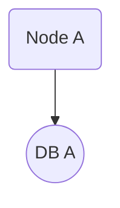

# Documentation

This project uses [Docsify](https://docsify.js.org/) for live, interactive documentation. All documentation files are in Markdown and can be previewed locally or deployed as a static site.

## Viewing Documentation Locally

1. Install Docsify CLI (if not already installed):
   ```sh
   npm install -g docsify-cli
   ```
2. Serve the docs:
   ```sh
   cd docs
   docsify serve
   ```
3. Open the provided local URL in your browser (usually http://localhost:3000).

## Structure

- `README.md`: Main entry point and overview
- `python_implementations.md`: Python DSP modules and usage
- `web_interface.md`: React web app details
- Additional files may be added for algorithms, API references, or tutorials

## Features

- Live preview of Markdown
- Mermaid diagrams and MathJax for math/flowcharts
- Tabs for code and explanations

## Example



$$
a \to b
$$

---

For more, see the other documentation files in this folder.
